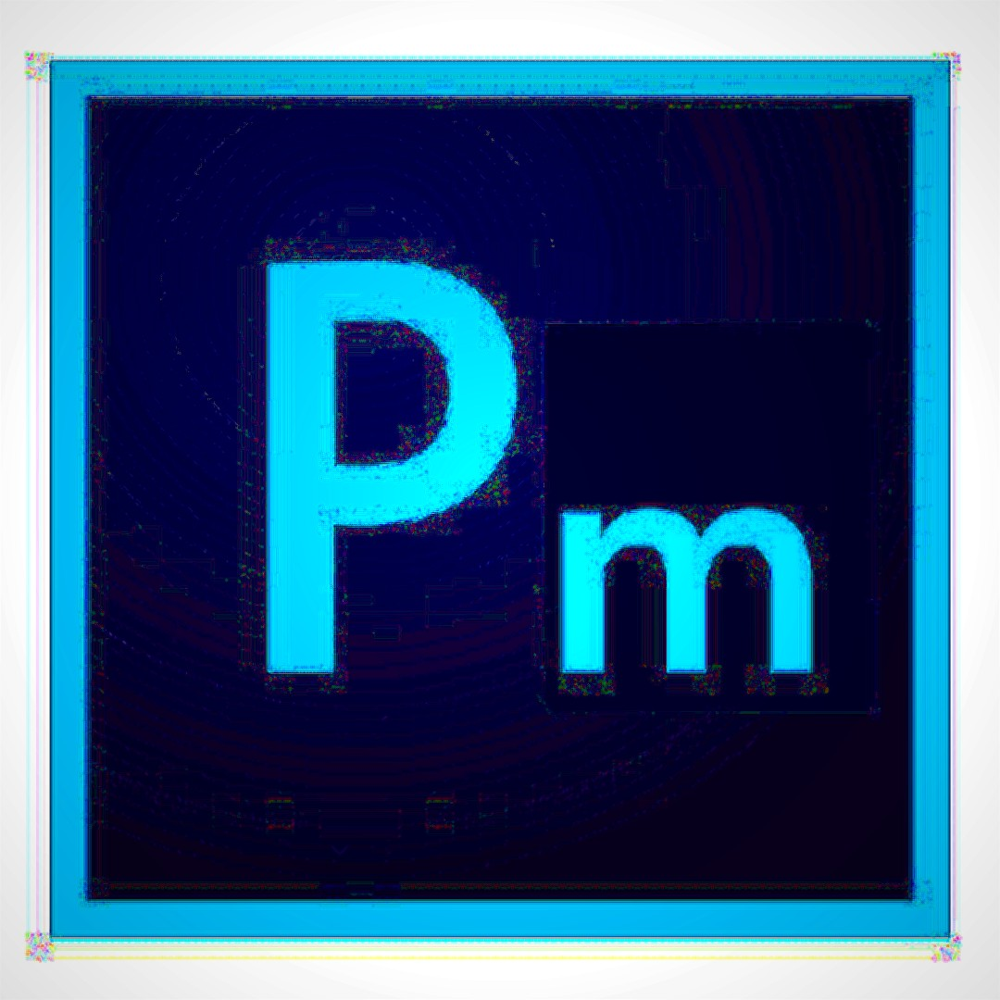

# Project Description

Photomarket (Pm) is a photo editor application that allows users to apply basic image manipulations to their photos, allowing your photo to get your desired look and feel. Our project is inspired by photo editors seen in our daily lives, mainly the iPhone one. The user can load their own image (or edit the preset image!) into the application and later one save the newly edited image into the same folder that their original image was in but with a post-fix to show that it is the edited photo. The application includes several image manipulations available: Blur, Sharpen, Exposure, Saturation, Moireing, Vignetting, Orange Tint, Blue Tint, and Cropping. The program also has Undo and Reset buttons available just in case you do not like the manipulations that you added. The final image that is saved when you press the save button will be the same one that you see on the interface when you press the save button.

Demo Video: [here](https://www.youtube.com/watch?v=pfJsYrNsm_4)

# Intended usage

When the user first loads the program, they will be prompted to select a photo from one of their folders which will then be loaded into the program. The user can also press "Cancel" the edit the preset image (of a wonderful orange cat!). After loading in the image, the user will be two columns of buttons on the right side of the interface. The user will be able to click those buttons (with their mouse) in order to apply its function onto the image. See below for a more detailed description of each button. The only exception to this is the crop manipulation. After pressing the crop button, this will turn on crop mode, which highlights four bars around the image. The user can then move the bars using arrow keys anad press the space bar to toggle between each bar. When the user in finished, they can turn off crop mode and the bard will turn grey. The space in between those bars will be which part of the photo that is captured after the user presses the save button. The user can still edit using all the other methods as they wish after cropping. After the user presses each button, the most recent manipulation that is successfully applied onto the photo will be displayed on the bottom left of the interface. Instructions for cropping can also be seen there as well. If at any point the user is unhappy about the actions they just performed, they can press the Undo button. Tey can also press the reset button to revert back to the original image.

|Function|Interface|Description|
| ---- | ---- | ------------------- |
| Blur | Button | Uses a kernel-based blurring mechanism to blur the entire image. Produces a dreamy effect. |
| Sharpening | Button | Uses a kernel-based sharpening mechanism to implement the hollywood "enhance" feature. |
| Exposure | Button +/- | Adjusts exposure of the image in 10% intervals relative to the source image. Use the +/- exposure buttons to correct for under/over-exposed images. +/- buttons for exposure cancel each other out. Makes image brighter/darker.|
| Saturation | Button +/- | Did your picture come out boring and flat? Dull, lifeless? Didn't have a crappy 2000s digicam that artificially boosted saturation for you? Just increase / decrease your saturation in 10% intervals with +/- buttons to either create an unrealistic vivid image, or a flat and boring monotone one. +/- works in a very similar way to saturation, they cancel each other out. Makes image more vibrant or dull.|
| Moireing | Button | Works best on high resolution files, which are currently being re-sized to 1080p to improve performance. Highlights the very center of the image to make it seem very bright. |
| Vignetting | Button | Darkens the corners in a radial fashion, to simulate a natural phenomenon in optics with dropoff at the edges. Increase vignetting to put the focus on the center subject. |
| Orange Tint | Button | Adds an orange tint to the image. Similar to a "warm filter" on iPhone photo editors. Can increase or decrease tint as you wish, is not a set amount of orange. |
| Blue Tint | Button | The same as Orange Tint, except its blue. Similar to a "cool filter". (Can be combined with Orange Tint to create a "green" tint!) |
| Undo | Button | Undoes the most recent action and works when the same manipulation is stacked. For example, if someone were to press exposure 5 times and press undo, all the exposure would not be removed. They would have to press Undo 5 times as well to revert back to the original image. |
| Reset | Button | Reverts image back to its original as if it was just loaded into the program. Works will all manipulations and cropping guides will go back into its original place as well. |
| Crop | Space + Arrow Keys | Was your image composition horrible? Couldn't zoom in farther? You're in luck! Using this non-proprietary cropping function, you too can get closer to your subject, without walking, only at the expense of resolution! After turning the crop guide on via the button, use SPACE to pick which border you're cropping, then use arrow keys to move the cropping guides. |
